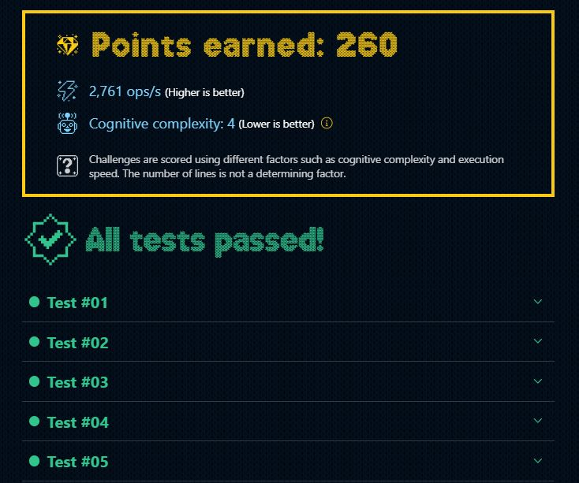

# DÍA 9: Alterna las luces

## Instrucciones

Están encendiendo las **luces de Navidad** 🎄 en la ciudad y, como cada año, ¡hay que arreglarlas!

Las luces son de dos colores: 🔴 y 🟢 . Para que el efecto sea el adecuado, **siempre deben estar alternadas.** Es decir, si la primera luz es roja, la segunda debe ser verde, la tercera roja, la cuarta verde, etc.

Nos han pedido que escribamos una función `adjustLights` que, dado un array de strings con el color de cada luz (representados con los emojis 🔴 para el rojo y 🟢 para el verde), devuelva el **número mínimo** de luces que hay que cambiar para que estén los colores alternos.

~~~javascript
adjustLights(['🟢', '🔴', '🟢', '🟢', '🟢'])
// -> 1 (cambias la cuarta luz a 🔴)

adjustLights(['🔴', '🔴', '🟢', '🟢', '🔴'])
// -> 2 (cambias la segunda luz a 🟢 y la tercera a 🔴)

adjustLights(['🟢', '🔴', '🟢', '🔴', '🟢'])
// -> 0 (ya están alternadas)

adjustLights(['🔴', '🔴', '🔴'])
// -> 1 (cambias la segunda luz a 🟢)
~~~

## Solución

~~~typescript
/** @Score 260puntos */
export function adjustLights(lights: string[]) {
  //Crea un arreglo con una alternativa correcta.
  const option = lights.map((_, i) => ['🔴', '🟢'][i%2] ) 
  
  //Se declaran dos tipos de cambios.
  let changes1: number = 0;
  let changes2: number = 0;
  
  //Recorre un bucle forEach por cada 'light' del arreglo del input.
  lights.forEach((light, i) => {
    //Si la 'light' del input, no es igual a la 'light' del arreglo se realiza un cambio.
    (light !== option[i]) 
      ? changes1++
      //Si en cambio es igual, se asume la existencia de un segundo arreglo con el patrón ['🟢', '🔴'], en este arreglo si que habrá que hacer un cambio y por lo tanto se agrega un cambio pero en una segunda opción.
      : changes2++;
  })
  
  //Se devuelve la solución con el menor número de cambios.
  return Math.min(changes1, changes2)
}
~~~

### --- Mejor resultado ---

