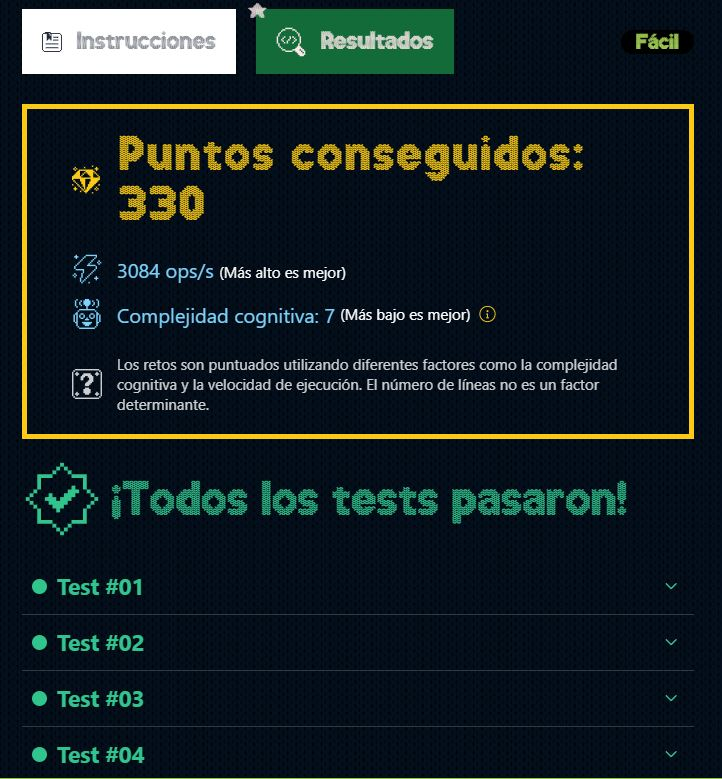

# DÍA 3: El elfo travieso

## Instrucciones

En el taller de Santa, **un elfo travieso** ha estado jugando en la cadena de fabricación de regalos, añadiendo o eliminando un paso no planificado.

Tienes la secuencia original de pasos en la fabricación *"original"* y la secuencia modificada *"modified"* que puede incluir un paso extra o faltar un paso.

Tu tarea es **escribir una función que identifique y devuelva el primer paso extra que se ha añadido o eliminado en la cadena de fabricación.** Si no hay ninguna diferencia entre las secuencias, devuelve una cadena vacía.

Por ejemplo:

~~~javascript
const original = 'abcd'
const modified = 'abcde'
findNaughtyStep(original, modified) // 'e'

const original = 'stepfor'
const modified = 'stepor'
findNaughtyStep(original, modified) // 'f'

const original = 'abcde'
const modified = 'abcde'
findNaughtyStep(original, modified) // ''
~~~

A tener en cuenta:

- Siempre habrá un paso de diferencia o ninguno.
- La modificación puede ocurrir en cualquier lugar de la cadena.
- La secuencia original puede estar vacía

## Solución

Si las palabras son iguales, no hará falta recorrer el algoritmo. Por el contrario, si son diferentes, primero obtendremos el tamaño de la palabra más grande. Y ayudándonos del bucle `for` procederemos a comparar los índices de cada palabra.

Una vez encontrado el índice diferente, devolvemos la letra que corresponda: al índice diferente de la palabra más grande.

~~~typescript
export function findNaughtyStep(original: string, modified: string) {
  if( original === modified ) return '';

  const maxLength = Math.max(original.length, modified.length);

  for( let i = 0; i < maxLength; i++ ) {
    if( original[i] !== modified[i] ) {
      return ( modified.length > original.length ) ? modified[i] : original[i];
    }
  }
}
~~~

## Mejor resultado

