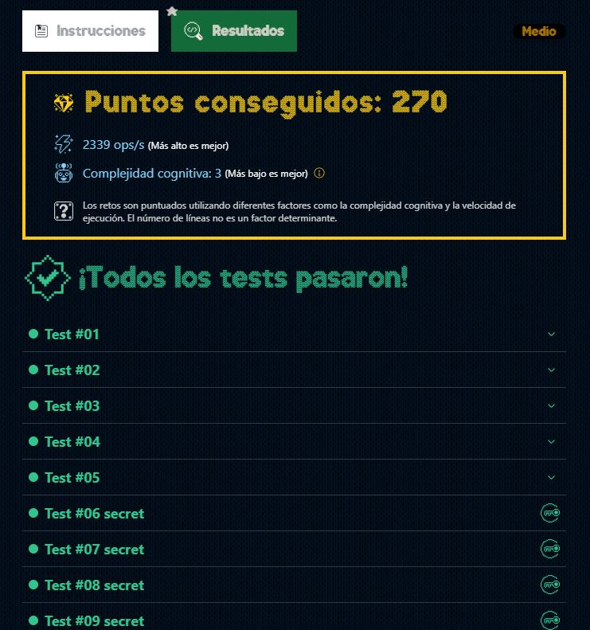

# DÍA 4: Dale la vuelta a los paréntesis

## Instrucciones

En el taller de Santa 🎅, algunos mensajes navideños han sido escritos de manera peculiar: **las letras dentro de los paréntesis deben ser leídas al revés.**

**Santa necesita que estos mensajes estén correctamente formateados.** Tu tarea es escribir una función que tome una cadena de texto y revierta los caracteres dentro de cada par de paréntesis, eliminando los paréntesis en el mensaje final.

Eso sí, ten en cuenta que **pueden existir paréntesis anidados,** por lo que debes invertir los caracteres en el orden correcto.

Por ejemplo:

~~~javascript
const a = decode('hola (odnum)')
console.log(a) // hola mundo

const b = decode('(olleh) (dlrow)!')
console.log(b) // hello world!

const c = decode('sa(u(cla)atn)s')
console.log(c) // santaclaus

// Paso a paso:
// 1. Invertimos el anidado -> sa(ualcatn)s
// 2. Invertimos el que queda -> santaclaus
~~~

A tener en cuenta:

- Las cadenas de entrada siempre estarán bien formadas con 
- paréntesis que coinciden correctamente, no necesitas validarlos.
- En el mensaje final no deben quedar paréntesis.
- El nivel máximo de anidamiento es 2.

## Solución

**Paso 1:** Se utiliza la expresión regular '/\(\w*\)/g' para encontrar todos los caracteres dentro de los paréntesis incluidos los paréntesis.
**Paso 2:** Se crea el ciclo 'while', el cual estará activo siempre que en el mensaje existan elementos paréntesis con o sin elementos dentro.
**Paso 3:** Con el bucle 'forEach' se reemplazan cada una de las coincidencias de la expresión regular por los caracteres invertidos y sin paréntesis.
**Paso 4:** Se devuelve el mensaje mutado.

~~~typescript
export function decode(message: string): string {
  const regex = /\(\w*\)/g
  
  while(message.match(regex)) {
    message.match(regex).forEach( msg => {
      message = message.replace(msg, (match => {
        return [...match].slice(1,-1).reverse().join('');
      }))
    })
  }

  return message;
}
~~~

### --- Mejor resultado ---

