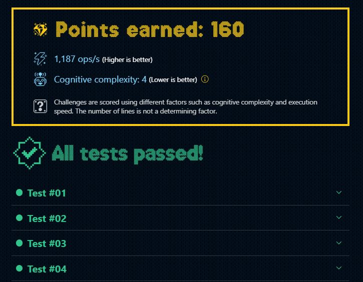

# DÍA 5: El CyberTruck de Santa 

## Instrucciones

Santa 🎅 está probando su nuevo trineo eléctrico, el CyberReindeer, en una carretera del Polo Norte. La carretera se representa con una cadena de caracteres, donde:

- **.** = Carretera
- **S** = Trineo de Santa
- __*__ = Barrera abierta
- **|** = Barrera cerrada

Ejemplo de carretera:  `S...|....|.....`

Cada unidad de tiempo, **el trineo avanza una posición a la derecha.** Si encuentra una barrera cerrada, se detiene hasta que la barrera se abra. Si está abierta, la atraviesa directamente.

**Todas las barreras empiezan cerradas,** pero después de 5 unidades de tiempo, se abren todas **para siempre.**

**Crea una función que simule el movimiento del trineo** durante un tiempo dado y **devuelva un array** de cadenas representando el estado de la carretera en cada unidad de tiempo:

Por ejemplo:

~~~typescript
const road = 'S..|...|..'
const time = 10 // unidades de tiempo
const result = cyberReindeer(road, time)

/* -> result:
[
  'S..|...|..', // estado inicial
  '.S.|...|..', // avanza el trineo la carretera
  '..S|...|..', // avanza el trineo la carretera
  '..S|...|..', // el trineo para en la barrera
  '..S|...|..', // el trineo para en la barrera
  '...S...*..', // se abre la barrera, el trineo avanza
  '...*S..*..', // avanza el trineo la carretera
  '...*.S.*..', // avanza el trineo la carretera
  '...*..S*..', // avanza el trineo la carretera
  '...*...S..', // avanza por la barrera abierta
]
*/
~~~

A tener en cuenta:

El resultado es un **array donde cada elemento muestra la carretera en cada unidad de tiempo.**

Ten en cuenta que **si el trineo está en la misma posición que una barrera,** entonces toma su lugar en el array.

Los elfos se inspiraron en este [reto de Code Wars.](https://www.codewars.com/kata/5d0ae91acac0a50232e8a547/javascript)

## Solución

- **Paso 1:** Re-asignamos la variable road, dejando la pista limpia (sin Santa). Luego declaramos las variables `steps` donde iremos acumulando el recorrido de Santa y `position`, donde almacenaremos la posición de Santa durante el recorrido. 
- **Paso 2:** Con el bucle `for`, vamos iterando sobre el tiempo de la prueba. Aquí se aplican las condicionales correspondientes al ejercicio:  
  - **Paso 2.1:** Si el tiempo es 5: todos los `|` se cambian por `*`
  - **Paso 2.3:** Por cada iteración se almacena el recorrido de Santa correspondiente a su posición. (Destructuramos road, asignamos la posición y volvemos a juntar road en un string, para despues almacenarlo en el array steps).
  - **Paso 2.3:** Si la posición delante de Santa no es `|`, podrá avanzar su posición en la siguiente iteración.
- **Paso 3:** Finalmente devolvemos los `steps` recorridos.

~~~typescript
export function cyberReindeer(road: string, time: number) {
  road = '.' + road.substring(1);
  const steps: string[] = [];
  let position: number = 0;

  for (let i = 0; i < time; i++) {  
    if (i === 5) {
      road = road.replace(/\|/g, '*');
      position++;
    }

    const patron = [...road];
    patron[position] = 'S';
    steps.push(patron.join(''));

    if (patron[position + 1] !== '|') {
      position++;
    }
  }

  return steps;
}
~~~

## Mejor resultado

