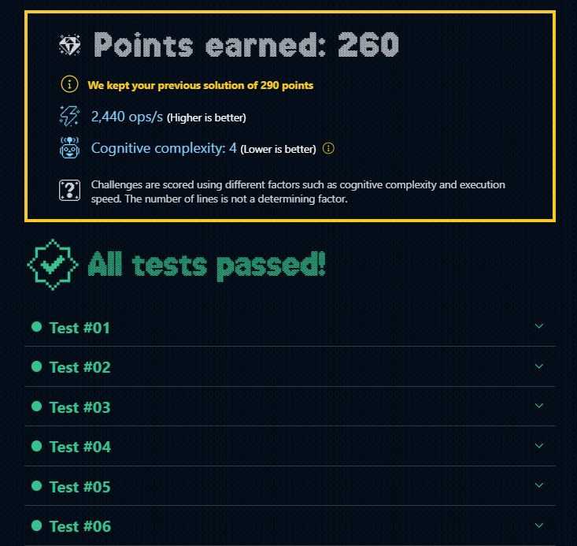

# DÍA 7: Las cajas en 3D

## Instrucciones

Santa está experimentando con nuevos diseños de regalos y **necesita tu ayuda para visualizarlos en 3D.**

Tu tarea es escribir una función que, dado un tamaño n (entero), **genere un dibujo de un regalo en 3D** utilizando caracteres ASCII.

Las líneas de los regalos se dibujan con # y las caras con el símbolo que nos pasan como parámetro:

~~~javascript
drawGift(4, '+')

/*
   ####
  #++##
 #++#+#
####++#
#++#+#
#++##
####
*/

drawGift(5, '*')
/*
    #####
   #***##
  #***#*#
 #***#**#
#####***#
#***#**#
#***#*#
#***##
#####
*/

drawGift(1, '^')
/*
#
*/
~~~

Importante:

Nos han dicho que siempre hay que dejar un salto **de línea al final del dibujo.**

Nota: 

Ten en cuenta que, en los tests, la primera línea se ve empujada por el caracter ".

## Solución

~~~typescript
export function drawGift(size: number, symbol: string) {
  const space: string = ' ';

  //Crea la envoltura del regalo con el tamaño del 'size' input.
  let gift: string = '#'.repeat(size) + '\n';

  //Entra en el condicional si el 'size' es mayor que 1
  if( size > 1 ) {
    //Agrega espacios para la envoltura superior.
    const northPole: string = space.repeat(size-1) + gift;
    //Crea la parte media de la envoltura.
    const equator: string = '#'.repeat(size) + symbol.repeat(size-2) + '#\n';
    //Crea la envoltura inferior.
    const southPole: string = gift;

    //Si el size es 2, el regalo solo tendrá 3 capas.
    if ( size == 2 ) gift = `${northPole}${equator}${southPole}`;
    //Entra en el condicional si 'size' es superior a 2
    else {
      let northTropic: string = '';
      let southTropic: string = '';

      //Itera un bucle para crea las capas restantes (size-2)
      for (let i = 0; i < size-2; i++) {
        //Construye el nuevo patrón por cada iterasión
        const newPattern: string = '#' + symbol.repeat(size-2) + '#' + symbol.repeat(i) + '#';
        //El patrón superior, por cada linea tendrá más espacios por delante.
        northTropic += space.repeat(size-2-i) + newPattern + '\n';
        //El patrón inferior será el patrón superior invertido pero sin espacios.
        southTropic = newPattern + '\n' + southTropic;
      }
    
      //Agrega todas las capas de envoltura al regalo
      gift = `${northPole}${northTropic}${equator}${southTropic}${southPole}`;
    }

  } 

  //Devuelve el regalo envuelto
  return gift;
}
~~~

## Mejor resultado

