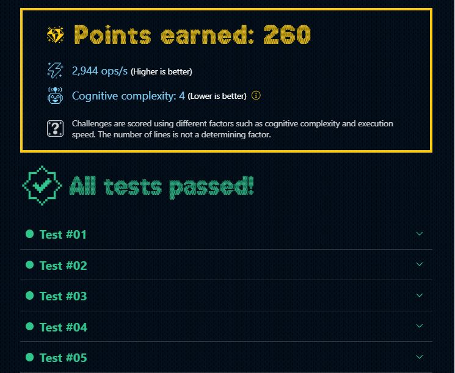

# DÍA 8: Ordenando el almacén

## Instrucciones

Los elfos están muy ocupados en el taller de Santa Claus organizando regalos 🎁 para la víspera de Navidad 🎄.

El formato de entrada es especial, ya que indica el número de regalos y el tipo de regalo con letras de la a a la z. Por ejemplo, '66a11b' significa 66 regalos a y 11 regalos b.

Los elfos tienen un sistema especial para organizar los regalos:

- Cada 10 regalos del mismo tipo se empaquetan en una caja, representada por **{x}**. Por ejemplo, 20 regalos tipo a se empaquetan en 2 cajas así: **{a}{a}**.
- Cada 5 cajas se apilan en un palé, representado por **[x]**. Por ejemplo, 10 cajas de a se apilan en 2 palés de esta manera: **[a][a]**
- Cualquier regalo adicional se coloca en una bolsa, representada por **()** y se colocan todas dentro. Por ejemplo 4 regalos de b se colocan en una bolsa así **(bbbb)**

Los regalos luego se colocan en el siguiente orden: palés, cajas y bolsas. Y los regalos aparecen en el mismo orden que la cadena de entrada.

Tu tarea es escribir una función organizeGifts que tome una cadena de regalos como argumento y devuelva una cadena representando el almacén.

Por ejemplo:

~~~typescript
const result1 = organizeGifts(`76a11b`)
console.log(result1) // '[a]{a}{a}(aaaaaa){b}(b)'
~~~

Explicación:

- 76a: 76 regalos tipo 'a' se empaquetarían en 7 cajas y sobrarían 6 regalos, resultando en 1 palé [a] (por las primeras 5 cajas), 2 cajas sueltas {a}{a} y una bolsa con 6 regalos (aaaaaa)

- 11b: 11 regalos tipo 'b' se empaquetarían en 1 caja y sobraría 1 regalo, resultando en 1 caja suelta {b} y una bolsa con 1 regalo (b)

## Solución

~~~typescript
/** @Score 260puntos */

export function organizeGifts(gifts: string) {
  //Declaración de expresión regular que devuelve todos los matches con el patrón ([number][character]) y dos grupos de captura correspondientes a estos últimos.
  const giftGroup = /(\d+)([a-z])/g;

  //Reemplaza cada uno de de los matches con el retorno del callback, al que se le pasan los grupos de captura: 'giftNumber' y 'giftChar'
  return gifts.replace(giftGroup, (_, giftNumber, giftChar) => {
    const total = parseInt(giftNumber);
    //Crea el patrón de los pallets, repitiendo el patrón [char], tantas veces como múltiplos de 50 del número total.
    const pallets = `[${giftChar}]`.repeat(Math.floor(total / 50));
    //Crea el patrón de los boxes, repitiendo el patrón {char}, tantas veces como múltiplos de 10 del resto del número anterior.
    const boxes = `{${giftChar}}`.repeat(Math.floor((total % 50) / 10));
    //Crea el patrón de los bags con tantos caracteres como el resultado del resto de las operaciones anteriores
    const bags = giftChar.repeat(total % 10);
    
    //Devuelve el resultado formateado.
    return `${pallets}${boxes}${bags ? `(${bags})` : ''}`;
  });
}
~~~

### --- Mejor resultado ---

