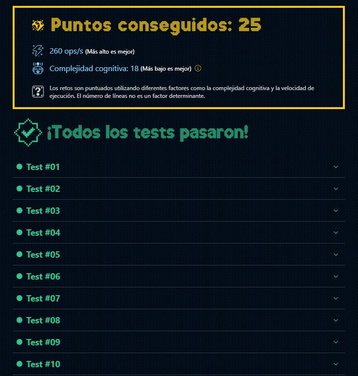

# DÍA [11]: Los elfos estudiosos

## Instrucciones

En el taller de Santa, los elfos aman los acertijos 🧠. Este año, han creado uno especial: un desafío para formar un palíndromo navideño.

**Un palíndromo es una palabra que se lee igual hacia adelante y hacia atrás.** Los elfos quieren saber si es posible formar un palíndromo haciendo, como mucho, un intercambio de letras.

Crea una función `getIndexsForPalindrome` que reciba una cadena de caracteres y devolverá:
- Si ya es un palíndromo, un array vacío.
- Si no es posible, null.
- Si se puede formar un palíndromo con un cambio, un array con las dos posiciones (índices) que se deben intercambiar para poder crearlo.

### Por ejemplo:

~~~javascript
getIndexsForPalindrome('anna') // []
getIndexsForPalindrome('abab') // [0, 1]
getIndexsForPalindrome('abac') // null
getIndexsForPalindrome('aaaaaaaa') // []
getIndexsForPalindrome('aaababa') // [1, 3]
getIndexsForPalindrome('caababa') // null
~~~

A tener en cuenta: Si se puede formar el palíndromo con diferentes intercambios, **siempre se debe devolver el primero que se encuentre.**

## Solución

~~~typescript
function getIndexsForPalindrome(word: string): number[] {
  // Función para verificar si una palabra es un palíndromo.
  const isPalindrome = (w: string) => w === w.split("").reverse().join("");

  // Función para intercambiar dos caracteres en una cadena.
  const changeCharacters = (string: string, index1: number , index2: number ): string => {
    let charArray: string[] = string.split('');
    let temp: string = charArray[index1];

    charArray[index1] = charArray[index2];
    charArray[index2] = temp;

    return charArray.join('');
  };

  // Si la palabra es un palíndromo retorna un string vacio.
  if( isPalindrome(word) ) return [];

  // El siguiente intercambia todos los caracteres de la cadena en orden, por cada iteración, 
  // revisa si la palabra modificada es palindroma, una vez encuentra la primera coincidencia,
  // devuelve un arreglo con los indices de los caracteres intercambiados
  for (let i = 0; i < word.length; i++) {
    for (let j = 0; j < word.length; j++) {
      const modifiedWord: string = changeCharacters(word, i, j);

      if (isPalindrome(modifiedWord)) {
        return [i, j];
      }
    }
  }

  // Si no se puede encontrar ningún par de índices que produzca un palíndromo, devuelve null
  return null;
}
~~~

## Mejor resultado

