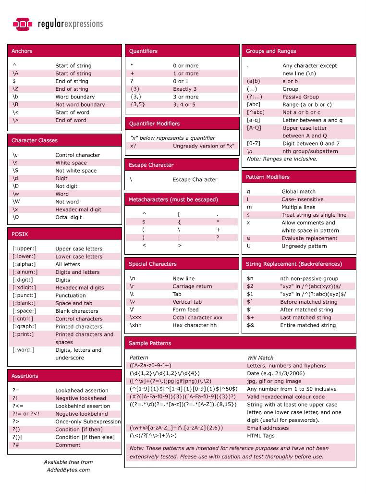
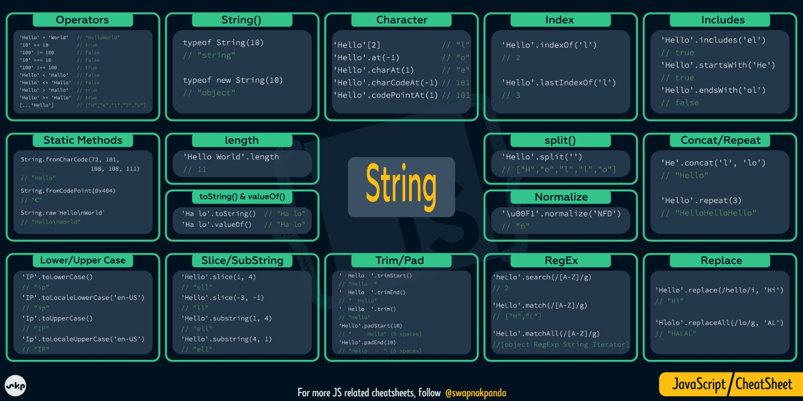

# DOCUMENTACIÓN

El objetivo de la presente documentación es ayudar a los aspirantes al AdventJS a adquirir las habilidades mínimas necesarias para desarrollar de manera optima cualquiera de los ejercicios planteados por el desafío. Todos estos documentos son de obtención gratuita y los he utilizado yo mismo en su momento para adquirir los conocimientos que me ayudaron a superar los desafíos.

#### Los recursos de la presente documentación:

1. Son 100% gratuitos.
2. Están actualizados con los principales métodos de Javascript para la resolución de los desafíos hasta el año 2023.
3. Los enlaces externos de la presente documentación, tendrán que tener la correcta citación a sus correspondientes autores. Y serán retirados de la documentación, siempre que los autores de los recursos lo soliciten.
4. Se aceptan sugerencias para mejorar la presente documentación.

(Correo de notificaciones - jcesar.code@gmail.com)

## ESTRUCTURAS DE CONTROL EN JS

### CONDICIONALES

- Documentación : Requiere busqueda.
- Sheatsheet    : No he encontrado uno actualizado.
- Video         : Requiere busqueda.

~~~
PASAR A CANVA:
--------------
- if() - elseIf() - else()
- Ternario: (condicional) ? return if true : return if false;
- switch()
~~~

### BUCLES

- Documentación : Requiere busqueda.
- Sheatsheet    : No he encontrado uno actualizado.
- Video         : Requiere busqueda.

~~~
PASAR A CANVA:
--------------
- for(i)    
- while()
- do()... while()
- for... in //trabaja con el index.
- for... of //trabaja con el elemento dentro del arreglo/objecto
~~~

## MÉTODOS PARA CONTROL DE STRINGS

- Documentación : [Documentación oficial](https://developer.mozilla.org/en-US/docs/Web/JavaScript/Reference/Global_Objects/String) - Grupo Mozilla.
- Sheatsheet    : [Array cheatsheet](https://pbs.twimg.com/media/FCJFcyUVEA4La2k.jpg:large) - Swapna Kumar Panda
- Video         : [All 34 String Methods In JavaScript in One Video](https://www.youtube.com/watch?v=x16Z_U1tGrc&ab_channel=CodeExplained) - Code Explained

##  EXPRESIONES REGULARES - (REGEXP)

- Documentación : [Documentación oficial](https://developer.mozilla.org/en-US/docs/Web/JavaScript/Reference/Global_Objects/RegExp/RegExp) - Grupo Mozilla.
- Sheatsheet    : [RegExp cheatsheet](https://finchan.wordpress.com/2010/02/06/cheat-sheet-of-regular-expressions/) - AddedBytes.com
- Video         : [Curso de expresiones regulares](https://www.youtube.com/playlist?list=PLDbrnXa6SAzVSo9gT9G0y4mMKoceTWhPk) - Diego Bastidas (@dfbastidas)
- Videos complementarios y recomendados: 
  - [15 EJEMPLOS PARA APRENDER EXPRESIONES REGULARES (REGEX)](https://www.youtube.com/watch?v=s1HUWsSe-ZU&ab_channel=VidaMRR-Programacionweb) - VidaMRR Programación Web (@vidamrr)
  - [8 EJEMPLOS PARA APRENDER EXPRESIONES REGULARES (REGEX)](https://www.youtube.com/watch?v=dzLbz3AFylE&ab_channel=VidaMRR-Programacionweb) - VidaMRR Programación Web (@vidamrr)
- Websites:
  - Web para testear expresiones regulares: https://regexr.com/
  - Retos con expresiones regulares: https://regex101.com/

## MÉTODOS "REGEXP" PARA JS 

- Documentación : [Documentación oficial](https://developer.mozilla.org/en-US/docs/Web/JavaScript/Guide/Regular_expressions#using_regular_expressions_in_javascript) - Grupo Mozilla.
- Sheatsheet    : Requiere búsqueda.
- Video         : Requiere búsqueda.

## MÉTODOS DE CONTROL DE ARRAYS JS

- Documentación : [Documentación oficial](https://developer.mozilla.org/en-US/docs/Web/JavaScript/Reference/Global_Objects/Array) - Grupo Mozilla.
- Sheatsheet    : [Array cheatsheet](https://www.reddit.com/media?url=https%3A%2F%2Fi.redd.it%2Fs8ev4pw1p4a61.jpg) - r/learnjavascript (usuario de reddit)
- Video         : [MÉTODOS DE ARREGLOS MODERNOS EN JAVASCRIPT](https://www.youtube.com/watch?v=bkgXlQp5hbI&ab_channel=VidaMRR-Programacionweb) - VidaMRR Programación Web (@vidamrr)
- Videos complementarios y recomendados: 
  - [All 33 JavaScript Array Methods in One Video](https://www.youtube.com/watch?v=RVxuGCWZ_8E&ab_channel=CodeExplained) - Code Explained

~~~
PASARA A CANVA - Nuevas funciones:
----------------------------------
- find(callback)  -> Devuelve el primer elemento de un array que satisface una condición.
                  Ejem -> [1, 2, 3].find(e => e === 2) // 2;
- includes(param) -> Devuelve true o false, si el array incluye el elemento pasado como parametro.
                  Ejem -> [1, 2, 3].includes(2) // true;
- flat(number)    -> Aplana un array, el número de anidaciones que le indíques por parámetro.
                  Ejem -> [1, 2, 3, [4, 5, [6, 7]]].flat(3) // [1, 2, 3, 4, 5, 6, 7];
- toReversed()    -> Nuevo, aún en desarrollo.
- toSorted()      -> Nuevo, aún en desarrollo.
- toSpliced()     -> Nuevo, aún en desarrollo.
- with()          -> Nuevo, aún en desarrollo.
~~~

~~~
PASAR A CANVA - Estrategias geniales:
-------------------------------------
- Los array methods se pueden concatenar.
- Para encontrar el máximo valor de un number[] : Math.max(...[number]);
- Ordenar aleatoriamente un arreglo: [elements].sort((a,b) => Math.random() - 0.5);
- Recuperar un elemento random de un arreglo: array[Math.floor(Math.random() * array.length)];
- Filtrar números únicos de un arreglo: [...new Set(arreglo)];
~~~

## OTROS PUBLICADORES DEL ADVENT JS
- [Ferniuz](https://dev.to/fenriuz)
- [DPortillo23](https://github.com/dportillo23/adventjs-2023/tree/master)
- [Achalogy](https://github.com/Achalogy/advent-js-2023/tree/main)
- [SantiMendez19](https://github.com/SantiMenendez19/adventjs/tree/main/2023)